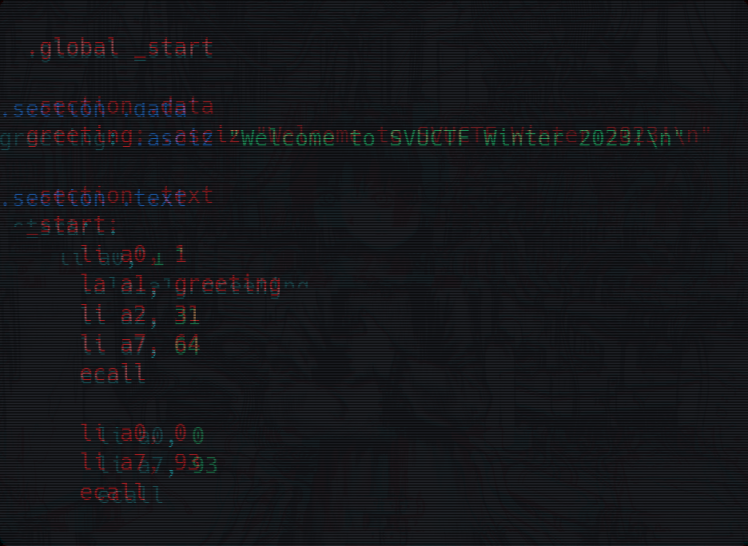

<div align="center">

# SVUCTF-WINTER-2023

本仓库用于存储和构建 SVUCTF-WINTER-2023 的题目镜像。

Powered by GZCTF and GZTime



</div>

## 目录

- [题目](#%E9%A2%98%E7%9B%AE)
  - [Misc](#Misc)
  - [Reverse](#Reverse)
  - [Pwn](#Pwn)
  - [Crypto](#Crypto)
  - [Web](#Web)
- [难度与分值](#%E9%9A%BE%E5%BA%A6%E4%B8%8E%E5%88%86%E5%80%BC)
- [花絮](#%E8%8A%B1%E7%B5%AE)
- [来自参赛者的题解](#%E6%9D%A5%E8%87%AA%E5%8F%82%E8%B5%9B%E8%80%85%E7%9A%84%E9%A2%98%E8%A7%A3)
- [往届比赛](#%E5%BE%80%E5%B1%8A%E6%AF%94%E8%B5%9B)
- [致谢](#%E8%87%B4%E8%B0%A2)

项目结构遵循 GZCTF 规范。

```
.github/workflows/                      # Github Actions
    └── <category>.<name>.yml               # 每个题目的编译脚本
challenges/                             # 所有题目
    ├── web/                                # 题目分类
    │   ├── challenge1/                         # 题目
    │   │   ├── build/                              # 构建文件
    │   │   │   ├── Dockerfile
    │   │   │   └── more...
    │   │   ├── attachments/                        # 附件
    │   │   ├── writeup/                            # 题解文件    
    │   │   └── README.md                           # 题目信息（含题解文本）
    │   └── more...
    └── more...
```

## 题目

### Misc

| 题目描述与题解 | 难度 | 文件、源代码 | 镜像 | 出题人 |
|:---|:---|:---|:---|:---|
| [ksks 的小夜曲](challenges/misc/midi/README.md) | - | [文件、源代码](challenges/misc/midi/build) | - | 13m0n4de |
| [esrever](challenges/misc/esrever/README.md) | - | [文件、源代码](challenges/misc/esrever/attachments) | - | 13m0n4de |
| [猫娘问答](challenges/misc/neko_quiz/README.md) | - | [文件、源代码](challenges/misc/neko_quiz/build) | [svuctf-winter-2023/neko_quiz](https://ghcr.io/svuctf/svuctf-winter-2023/neko_quiz) | 13m0n4de |
| [蟹皇堡秘方](challenges/misc/cyberchef_recipe/README.md) | - | [文件、源代码](challenges/misc/cyberchef_recipe/build) | - | 13m0n4de |

### Reverse

| 题目描述与题解 | 难度 | 文件、源代码 | 镜像 | 出题人 |
|:---|:---|:---|:---|:---|
| [圣诞礼物](challenges/reverse/christmas_gift/README.md) | - | [文件、源代码](challenges/reverse/christmas_gift/attachments) | - | 13m0n4de |
| [Golang](challenges/reverse/Golang/README.md) | - | [文件、源代码](challenges/reverse/Golang/build) | - | pn1fg |
| [solver](challenges/reverse/Solver/README.md) | - | [文件、源代码](challenges/reverse/Solver/build) | - | pn1fg |
| [CGI](challenges/reverse/CGI/README.md) | - | [文件、源代码](challenges/reverse/CGI/build) | [svuctf-winter-2023/cgi](https://ghcr.io/svuctf/svuctf-winter-2023/cgi:latest) | pn1fg |

### Pwn

| 题目描述与题解 | 难度 | 文件、源代码 | 镜像 | 出题人 |
|:---|:---|:---|:---|:---|
| [nc](challenges/pwn/nc/README.md) | - | [文件、源代码](challenges/pwn/nc/build) | [svuctf-winter-2023/nc](https://ghcr.io/svuctf/svuctf-winter-2023/nc:latest) | 13m0n4de |
| [Candy](challenges/pwn/candy/README.md) | - | [文件、源代码](challenges/pwn/candy/build) | [svuctf-winter-2023/candy](https://ghcr.io/svuctf/svuctf-winter-2023/candy) | pn1fg |
| [babyrop](challenges/pwn/babyrop/README.md) | - | [文件、源代码](challenges/pwn/babyrop/build) | [svuctf-winter-2023/babyrop](https://ghcr.io/svuctf/svuctf-winter-2023/babyrop) | pn1fg |
| [flipper](challenges/pwn/flipper/README.md) | - | [文件、源代码](challenges/pwn/flipper/build) | [svuctf-winter-2023/flipper](https://ghcr.io/svuctf/svuctf-winter-2023/flipper:latest) | 13m0n4de |

### Crypto

| 题目描述与题解 | 难度 | 文件、源代码 | 镜像 | 出题人 |
|:---|:---|:---|:---|:---|
| [Simple-RSA](challenges/crypto/simple_rsa/README.md) | - | [文件、源代码](challenges/crypto/simple_rsa/attachments) | - | Cee |
| [变异凯撒](challenges/crypto/BY_Caesar/README.md) | - | [文件、源代码](challenges/crypto/BY_Caesar/attachments) | - | Cee |
| [签到](challenges/crypto/qiandao/README.md) | - | [文件、源代码](challenges/crypto/qiandao/attachments) | - | Cee |

### Web

| 题目描述与题解 | 难度 | 文件、源代码 | 镜像 | 出题人 |
|:---|:---|:---|:---|:---|
| [FlagServer](challenges/web/flagserver/README.md) | - | [文件、源代码](challenges/web/flagserver/build) | [svuctf-winter-2023/flagserver](https://ghcr.io/svuctf/svuctf-winter-2023/flagserver:latest) | 13m0n4de |
| [上传？上传！](challenges/web/ez_upload/README.md) | - | [文件、源代码](challenges/web/ez_upload/build) | [svuctf-winter-2023/ez_upload](https://ghcr.io/svuctf/svuctf-winter-2023/ez_upload:latest) | Cee |
| [热血沸腾的组合技](challenges/web/tonyenc/README.md) | - | [文件、源代码](challenges/web/tonyenc/build) | [svuctf-winter-2023/tonyenc](https://ghcr.io/svuctf/svuctf-winter-2023/tonyenc:latest) | 13m0n4de |
| [题解分享频道](challenges/web/writeup_channel/README.md) | - | [文件、源代码](challenges/web/writeup_channel/build) | [svuctf-winter-2023/writeup_channel](https://ghcr.io/svuctf/svuctf-winter-2023/writeup_channel:latest) | 13m0n4de |## 花絮

## 来自参赛者的题解

## 往届比赛

- [SVUCTF/SVUCTF-HELLOWORLD-2023](https://github.com/SVUCTF/SVUCTF-HELLOWORLD-2023) 破晓工作室 2023 招新赛

## 致谢

- [GZCTF](https://github.com/GZTimeWalker/GZCTF/)：比赛平台
