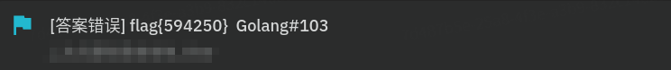

# 花絮

本次比赛共提交 78 次 Flag ，41 次错误提交。

到了期末周，希望大家比赛和考试都能开心。

## flag

### 《抢跑》

### 疑似人工智能入侵

智械危机

智械危机 2.0

### 你说你是什么？

### 怎么能是假的呢 o.O ？

怎么能是假的呢 o.O ？xN（笑点解析：同一人）

### 手抄 Flag 抄错

`flag{Someting_For_Nothing}` & `flag(Something_For_Nothing)`

## 群聊

### 自己给自己播报

### 群恭喜机器人

## 出题

### 假传圣旨

[#26](https://github.com/SVUCTF/SVUCTF-WINTER-2023/issues/26) [#44](https://github.com/SVUCTF/SVUCTF-WINTER-2023/issues/44)

### 偷题未遂

[#41](https://github.com/SVUCTF/SVUCTF-WINTER-2023/issues/41#issuecomment-1865410342)

### 《有空》

结合上下文阅读效果更佳。

## 比赛海报生成

写了个 RISC-V 汇编程序 [poster.s](../assets/poster.s)，输出 `Welcome to SVUCTF Winter 2023!`。

然后使用 [https://carbon.now.sh/](https://carbon.now.sh/) 生成了一张带有背景的代码图。

最后用 [glitch-this](https://github.com/TotallyNotChase/glitch-this) 添加故障特效。
