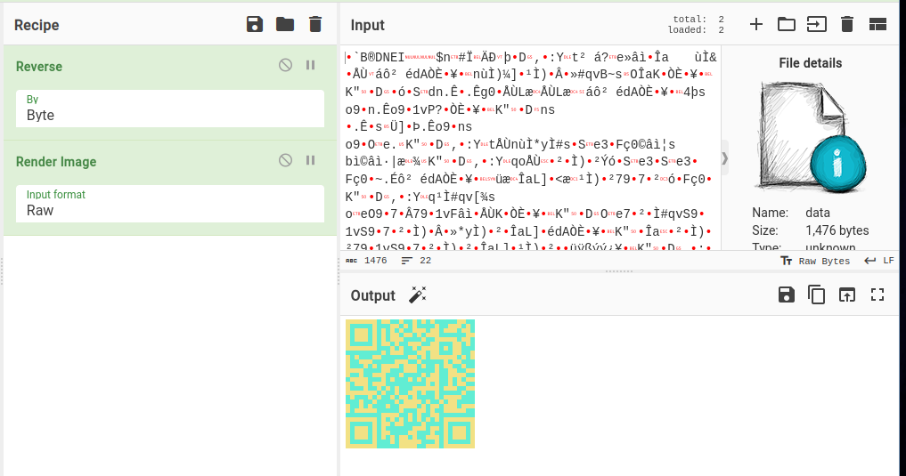
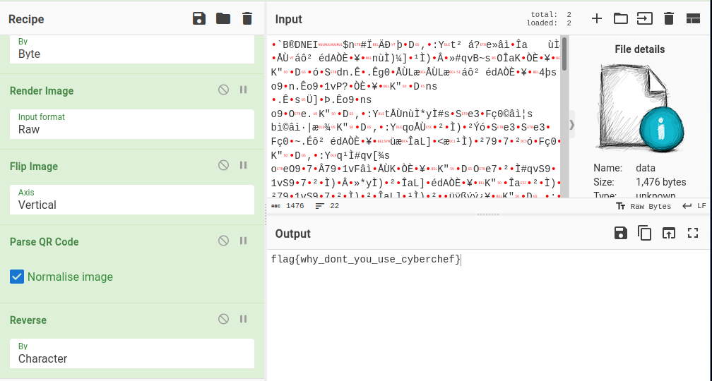

# esrever

- 作者：13m0n4de
- 参考：SVUCTF-2023
- 难度：Baby/Trivial/Easy/Normal/Medium/Hard/Expert/Insane
- 分类：Misc
- 镜像：-
- 端口：-

## 题目描述

## 题目解析

十六进制形式查看附件，发现末尾有倒过来的 `PNG`、`IHDR` 等关键字，判断是逐字节倒序的 PNG 文件。

```
$ xxd data | tail
00000530: 8dc5 d96e f9cc 217c 3e96 441d 2c88 3a59  ...n..!|>.D.,.:Y
00000540: 1074 b220 e373 9846 e2ec b77c e614 c5d9  .t. .s.F...|....
00000550: 4ce6 14c5 d94c e614 c5d9 1b9c c298 bb23  L....L.........#
00000560: 7398 46e2 eca6 7308 97e2 fe3f d7f9 ff6f  s.F...s....?...o
00000570: eb5d e0f9 9a33 e3ad 826b 727f ce41 200a  .]...3...kr..A .
00000580: 02a1 6b8a 5c06 826e 0540 d737 ba1b ad87  ..k.\..n.@.7....
00000590: d186 0d5d 758d b1c1 ed01 7854 4144 498b  ...]u.....xTADI.
000005a0: 0500 0023 5ad8 c300 0000 0608 9100 0000  ...#Z...........
000005b0: 9100 0000 5244 4849 0d00 0000 0a1a 0a0d  ....RDHI........
000005c0: 474e 5089                                GNP.
```

使用 CyberChef 逐字节倒序再渲染图像：



发现是一个变了色并且上下翻转的二维码。

使用 `Flip Image` 翻转回来，再用 `Parse QR Code` 识别二维码（需要勾选 `Normalise Image`，因为图像不是黑白的）。

识别出来是字符反转的 Flag，再 `Reverse` 一次就好。

最终的 Recipe 如下：

```
Reverse('Byte')
Render_Image('Raw')
Flip_Image('Vertical')
Parse_QR_Code(true)
Reverse('Character')
```



实际上不 `Flip Image` 也可以，同样能够识别二维码。

这题可以完全在 CyberChef 中完成，包括判断文件类型、十六进制查看文件等等。
