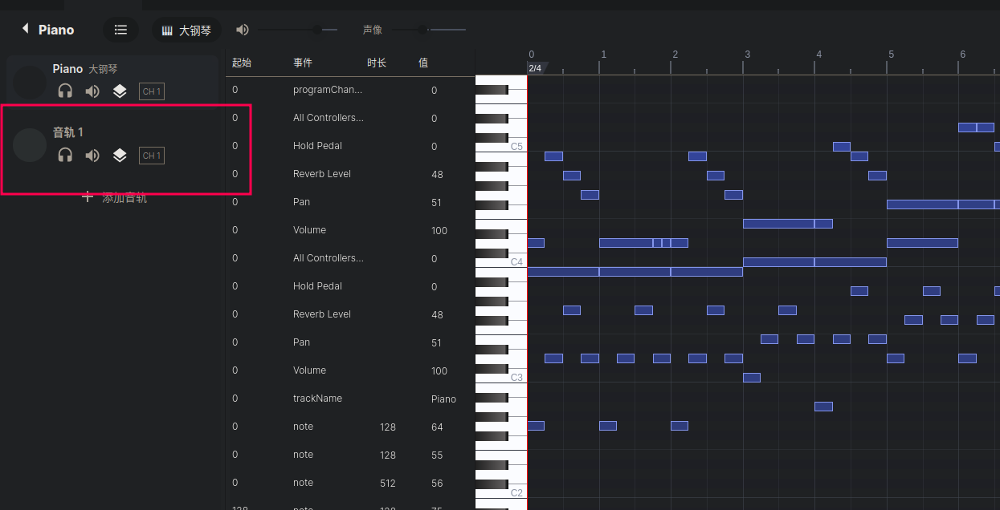

# ksks 的小夜曲

- 作者：13m0n4de
- 参考：[Advent-Calendar-CTF-2019-Musical-Stegano](https://ctftime.org/task/10148)
- 难度：Medium
- 分类：Misc
- 镜像：-
- 端口：-

## 题目描述

> Hint：解题不需要深厚的乐理知识，但至少需要了解 G 大调音阶，可以在这里找到介绍：https://en.wikipedia.org/wiki/G_major

## 题目解析

灵感来源于 [Advent-Calendar-CTF-2019-Musical-Stegano](https://ctftime.org/task/10148)，它的题解：[therhd/overthewire_advent_2019](https://github.com/therhd/overthewire_advent_2019)，基本上就是做了个极简版。

附件给的是一个 MIDI 文件，播放后可以听到 Jingle Bells 其中夹杂了一些不和谐的音。

~~你可以使用绝对音感把它们全部记下来~~

你可以使用各种音乐制作软件或者 MIDI 编辑器打开它，最好是能看见 MIDI 文件有多少个 Truck 。

如果你没有相关软件，也可以使用开源在线的，[https://signal.vercel.app](https://signal.vercel.app)。



会发现除了正常的 Jingle Bells ，还有一个没名字的音轨，但点进去什么音符都没有。

这和 MIDI 文件的制作过程有关系：[gen.py](./build/gen.py)，软件不认为那些是完好的音。

MuseScore 倒是可以看到这个轨道对应的五线谱，但读谱不够直观。

先用程序来解析一下 MIDI 文件：

```python
>>> from mido import MidiFile
>>> mid = MidiFile("G_Major_Jingle_Bells.mid")
>>> len(mid.tracks)
3
```

发现有三条 track ，第三条的 Message 规律得奇怪：

```python
>>> mid.tracks[2]
MidiTrack([
  Message('note_off', channel=0, note=0, velocity=0, time=4096),
  Message('note_on', channel=0, note=71, velocity=64, time=256),
  Message('note_on', channel=0, note=67, velocity=64, time=256),
  Message('note_on', channel=0, note=74, velocity=64, time=256),
  Message('note_off', channel=0, note=0, velocity=0, time=0),
  Message('note_on', channel=0, note=71, velocity=64, time=256),
  Message('note_on', channel=0, note=69, velocity=64, time=256),
  Message('note_on', channel=0, note=72, velocity=64, time=256),
  Message('note_off', channel=0, note=0, velocity=0, time=0),
  Message('note_on', channel=0, note=69, velocity=64, time=256),
  Message('note_on', channel=0, note=78, velocity=64, time=256),
  Message('note_on', channel=0, note=78, velocity=64, time=256),
  Message('note_off', channel=0, note=0, velocity=0, time=0),
  Message('note_on', channel=0, note=71, velocity=64, time=256),
  Message('note_on', channel=0, note=67, velocity=64, time=256),
  Message('note_on', channel=0, note=76, velocity=64, time=256),
  Message('note_off', channel=0, note=0, velocity=0, time=0),
```

都是连着三个 `note_on` 再加上一个 `note_off` ，如果再仔细观察，会发现它们都在一个八度之内（`note` 的值）。

更确切的说，它们只有七个音，对应着 G 大调音阶中的：`G4 A4 B4 C4 D4 E4 F#4`

`note` 值分别为 `67 69 71 72 74 76 78`

将 `flag{` 转换为十进制 Charcode （ASCII 码）和七进制 Charcode ：

| f   | l   | a   | g   | {   |
|:----|:----|:----|:----|:----|
| 102 | 108 | 97  | 103 | 123 |
| 204 | 213 | 166 | 205 | 234 |

我们拿第一个 Message 举例

```python
  Message('note_on', channel=0, note=71, velocity=64, time=256),
  Message('note_on', channel=0, note=67, velocity=64, time=256),
  Message('note_on', channel=0, note=74, velocity=64, time=256),
```

`note` 值为 `71 67 74`，分别是 `67 69 71 72 74 76 78` 中的第 `2` 个、第 `0` 个、第 `4` 个。

正好对应字符 `f` 的七进制 Charcode `204`。

完整的解码脚本 [decode.py](./writeup/decode.py)：

```python
from mido import MidiFile

g_major_scale = [67, 69, 71, 72, 74, 76, 78]
mid = MidiFile("../attachments/G_Major_Jingle_Bells.mid")

flag = ""
temp_charcode = ""

for msg in mid.tracks[2]:
    if msg.type == "note_on":
        index = g_major_scale.index(msg.note)
        temp_charcode += str(index)

    # 当遇到 note_off 并且有缓存的 Charcode
    elif len(temp_charcode) != 0:
        charcode = int(temp_charcode, 7)
        temp_charcode = ""
        flag += chr(charcode)

print(flag)
```

```
flag{3NJoy_thE_D1ScoRdANt_note5}
```
