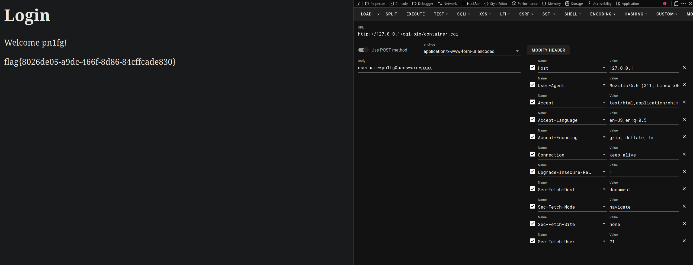

# Web 逆向

- 作者：pn1fg
- 参考：SVUCTF-2023
- 难度：Baby/Trivial/Easy/Normal/Medium/Hard/Expert/Insane
- 分类：Reverse
- 镜像：
- 端口：

# 题目描述

@pn1fg：「每次都是 Web，Pwn 有动态容器，其它的方向没意思...」  
@13m0n4de：「Reverse 也可以搞！」  
@13m0n4de：「可以试着用 C 语言写个 CGI...」  
@pn1fg：「太难了，又得会逆向，又得会 Web 才能写这一题...」
@13m0n4de：「热血沸腾的组合技...」

# 题目解析

- 源码：[main.c](build/main.c)
- 考点：CGI 逆向分析，POST 传参

`CGI` （Common Gateway Interface，“通用网关接口”），是一种用于在Web服务器和外部应用程序之间传递数据的标准协议。CGI程序能够处理从Web浏览器发送到服务器的HTTP请求，并根据请求生成动态网页内容。

### 查看文件信息
查壳：
```shell
$ diec challenge.cgi
ELF64
    Operation system: Unix(-)[DYN AMD64-64]
    Compiler: gcc((GNU) 12.2.1 20230201)[DYN AMD64-64]
```
64位，ELF可执行文件

反编译文件：

- 查看`main`函数
```c++
ulong main(void)

{
    int32_t iVar1;
    ulong uVar2;
    int64_t in_FS_OFFSET;
    ulong stream;
    ulong ptr;
    ulong str;
    ulong s1;
    ulong var_c4h;
    ulong var_80h;
    ulong var_40h;
    int64_t var_8h;

    var_8h = *(in_FS_OFFSET + 0x28);
    var_c4h._0_4_ = 0;
    sym.imp.printf(0x2000);
    sym.imp.printf("<html><head><title>Login</title></head><body>\n");
    sym.imp.printf("<h1>Login</h1>\n");
    uVar2 = sym.imp.getenv("REQUEST_METHOD");
    iVar1 = sym.imp.strcmp(uVar2, "POST");
    if (iVar1 == 0) {
        uVar2 = sym.imp.getenv("CONTENT_LENGTH");
        iVar1 = sym.imp.atoi(uVar2);
        uVar2 = sym.imp.malloc(iVar1 + 1);
        sym.imp.fgets(uVar2, iVar1 + 1, *_reloc.stdin);
        sym.imp.sscanf(uVar2, "username=%[^&]&password=%s", &var_40h, &var_80h);
        sym.imp.free(uVar2);
        sym.imp.printf("<p>Welcome %s!</p>\n", &var_40h);
        iVar1 = sym.imp.strcmp(&var_40h, "pn1fg");
        if ((iVar1 == 0) && (iVar1 = sym.imp.strcmp(&var_80h, "pxpx"),  iVar1 == 0)) {
            uVar2 = sym.imp.fopen("/flag", 0x20bc);
            sym.imp.fgets(&var_c4h + 4, 0x32, uVar2);
            sym.imp.fclose(uVar2);
            sym.imp.printf("<p>%s</p>\n", &var_c4h + 4);
        }
    }
    sym.imp.printf("</body></html>");
    if (*(in_FS_OFFSET + 0x28) != var_8h) {
        uVar2 = sym.imp.__stack_chk_fail();
        return uVar2;
    }
    return 0;
}
```
上面的题目解析中也提到了本题考察的是 `CGI程序` 逆向，不太能理解的可以大概将它理解成一种制作动态网页的程序，还需要了解 `CGI` 程序的默认访问路径 `cgi-bin/文件名`

分析程序，这整个程序大体是在写一个简单的登录功能，`getenv` 函数的作用是获取环境变量值，然后程序接收并解析 `POST` 传参的内容，紧接着是 `if` 条件判断，如果 `username` 的值为 `pn1fg` 并且 `password` 的值为 `pxpx` 即可以读取 `flag`，所以这题我们只需要向远程环境发送一个 `POST` 请求即可

### 编写利用程序

- 利用`curl`：
```
$ curl "http://127.0.0.1/cgi-bin/challenge.cgi" -d "username=pn1fg&password=pxpx"
<html><head><title>Login</title></head><body>
<h1>Login</h1>
<p>Welcome pn1fg!</p>
<p>flag{8026de05-a9dc-466f-8d86-84cffcade830}
</p>
</body></html>⏎        
```

- 利用 `hackbar` ：


