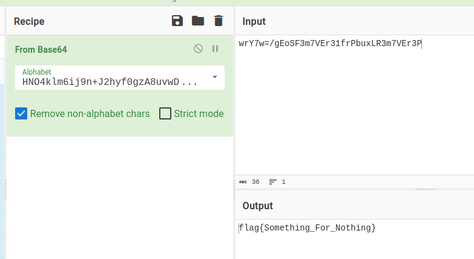

# Golang

- 作者：pn1fg
- 参考：-
- 难度：Baby/Trivial/Easy/Normal/Medium/Hard/Expert/Insane
- 分类：Reverse
- 镜像：-
- 端口：-

## 题目描述

## 题目解析

- 源码：[main.go](build/main.go)
- 附件：[golang](attachments/golang)
- 考点：Go 语言逆向，Base64（更换字符表）

### 查看文件信息

查壳（`diec`）：

```shell
$ diec golang
ELF64
    Operation system: Unix(-)[EXEC AMD64-64]
    Compiler: Go(1.10.x-1.17.x)[EXEC AMD64-64]
```

无壳，Golang 编写的程序。

查看文件类型（`file`）：

```shell
$ file golang
golang: ELF 64-bit LSB executable, x86-64, version 1 (SYSV), statically linked, Go BuildID=Edm8WlskT-DC-VbimwnB/hvFL5kDvLyUEd-A_MZiD/8JxUY-UOVv9nv8SKuJox/TgohkFrtk2D3lwitBCHK, stripped
```

64位 ELF 可执行文件,去除符号（`stripped`）

我们知道去符号后的程序难以分析，但 Go 二进制文件其实没有完全 strip ，其中存在某些结构中依然保存着函数名信息，因为 Golang 的二进制文件里打包进去了 runtime 和 GC 模块，还有独特的 Type Reflection(类型反射) 和 Stack Trace 机制，它们都需要这些信息。

推荐文章：

1. [Go二进制文件逆向分析从基础到进阶——综述](https://www.anquanke.com/post/id/214940)
1. [Go二进制文件逆向分析从基础到进阶——MetaInfo、函数符号和源码文件路径列表](https://www.anquanke.com/post/id/215419)
1. [Go二进制文件逆向分析从基础到进阶——数据类型](https://www.anquanke.com/post/id/215820)
1. [Go二进制文件逆向分析从基础到进阶——itab与strings](https://www.anquanke.com/post/id/218377)
1. [Go二进制文件逆向分析从基础到进阶——Tips与实战案例](https://www.anquanke.com/post/id/218674)

在综述中作者推荐了一些 插件/工具 来帮助我们还原 Golang 符号。这是文章作者制作的插件：[0xjiayu/go_parser](https://github.com/0xjiayu/go_parser)

或者可以使用 IDA 8.x ，对 Golang 进行了更好的支持，不需要做额外的操作就能很舒适地反编译。


`main_main` 函数

```go
void __fastcall main_main()
{
  int v0; // edi
  int v1; // esi
  __int64 v2; // r14
  int v3; // r8d
  int v4; // r9d
  int v5; // r8d
  int v6; // r9d
  __int64 v7; // r10
  __int64 v8; // r11
  int v9; // ecx
  int v10; // r8d
  int v11; // r9d
  __int64 v12; // r10
  __int64 *v13; // rax
  __int64 v14; // rax
  int v15; // ecx
  int v16; // r8d
  int v17; // r9d
  int v18; // r10d
  int v19; // r11d
  int v20; // r8d
  int v21; // r9d
  int v22; // r10d
  int v23; // r11d
  int v24; // r10d
  int v25; // r11d
  int v26; // r9d
  int v27; // r10d
  int v28; // r11d
  int v29; // r8d
  int v30; // r9d
  int v31; // r10d
  int v32; // r11d
  __int64 v33; // [rsp+10h] [rbp-2F8h]
  __int64 v34; // [rsp+10h] [rbp-2F8h]
  __int64 v35; // [rsp+10h] [rbp-2F8h]
  __int64 v36; // [rsp+10h] [rbp-2F8h]
  __int64 v37; // [rsp+10h] [rbp-2F8h]
  __int64 v38; // [rsp+10h] [rbp-2F8h]
  __int64 v39; // [rsp+18h] [rbp-2F0h] BYREF
  __int64 v40; // [rsp+20h] [rbp-2E8h]
  __int64 v41; // [rsp+28h] [rbp-2E0h]
  __int64 v42; // [rsp+30h] [rbp-2D8h]
  __int64 v43; // [rsp+38h] [rbp-2D0h]
  __int64 v44; // [rsp+40h] [rbp-2C8h]
  __int64 v45; // [rsp+48h] [rbp-2C0h]
  __int64 v46; // [rsp+50h] [rbp-2B8h]
  __int64 v47; // [rsp+58h] [rbp-2B0h]
  __int64 v48; // [rsp+60h] [rbp-2A8h]
  __int64 v49; // [rsp+68h] [rbp-2A0h]
  __int64 v50; // [rsp+70h] [rbp-298h]
  __int64 v51; // [rsp+78h] [rbp-290h]
  __int64 v52; // [rsp+80h] [rbp-288h]
  __int64 v53; // [rsp+88h] [rbp-280h]
  __int64 v54[22]; // [rsp+90h] [rbp-278h] BYREF
  int v55; // [rsp+140h] [rbp-1C8h]
  __int64 v56; // [rsp+148h] [rbp-1C0h]
  __int64 v57; // [rsp+150h] [rbp-1B8h]
  int v58; // [rsp+158h] [rbp-1B0h]
  __int64 v59; // [rsp+160h] [rbp-1A8h]
  _BYTE v60[36]; // [rsp+16Ch] [rbp-19Ch] BYREF
  __int64 v61; // [rsp+190h] [rbp-178h]
  char v62[320]; // [rsp+198h] [rbp-170h] BYREF
  __int64 v63; // [rsp+2D8h] [rbp-30h]
  __int64 v64; // [rsp+2E0h] [rbp-28h]
  _slice_uint8 *p__slice_uint8; // [rsp+2E8h] [rbp-20h]
  RTYPE *v66; // [rsp+2F0h] [rbp-18h] BYREF
  _slice_uint8 *v67; // [rsp+2F8h] [rbp-10h]

  while ( (unsigned __int64)v54 <= *(_QWORD *)(v2 + 16) )
    runtime_morestack_noctxt();
  p__slice_uint8 = (_slice_uint8 *)runtime_newobject(&RTYPE__slice_uint8);
  p__slice_uint8->ptr = 0LL;
  qmemcpy(v60, "wrY7w=/gEoSF3m7VEr31frPbuxLR3m7VEr3P", sizeof(v60));
  v66 = &RTYPE_string;
  v67 = (_slice_uint8 *)&off_4C35A0;
  fmt_Print((unsigned int)&v66, 1, 1, v0, v1, v3, v4);
  v66 = &RTYPE__ptr__slice_uint8;
  v67 = p__slice_uint8;
  fmt_Scan((unsigned int)&v66, 1, 1, v0, v1, v5, v6, v7, v8, v33);
  v13 = (__int64 *)encoding_base64_NewEncoding((unsignedint"HNO4klm6ij9+J2hyf0gzA8uvwDEq3X1Q7ZKeFrWcVTtsMRGYbdxSo=ILaUpPBC",64,v9,v0,v1,v10,v11,v12);
  v61 = *v13;
  v14 = ((__int64 (__fastcall *)(char *, __int64 *))loc_45D5C8)(v62, v13 + 1);
  v34 = v61;
  ((void (__golang *)(__int64, __int64, __int64, __int64 *, char *))loc_45D5C8)(v14, 64LL, v61, &v39, v62);
  v63 = encoding_base64_Encoding_WithPadding(53,64,v15,(unsigned int)&v39,(unsigned int)v62,v16,v17,v18,v19,v34,
v39,v40,v41,v42,v43,v44,v45,v46,v47,v48,v49,v50,v51,v52,v53,v54[0],v54[1],v54[2],v54[3],v54[4],v54[5],v54[6],v54[7],v54[8],v54[9],v54[10],v54[11],v54[12],v54[13],v54[14],v54[15],v54[16],v54[17],v54[18],v54[19],v54[20],v54[21],v55,v56,v57,v58);
  v59 = encoding_base64__ptr_Encoding_EncodedLen(v63, p__slice_uint8->len);
  v64 = runtime_makeslice((unsigned int)&RTYPE_uint8,v59,v59,(unsigned int)&v39,(unsigned int)v62,v20,v21,v22,v23,v35,v39,v40);
  encoding_base64__ptr_Encoding_Encode(v63,v64,v59,v59，p__slice_uint8->ptr,p__slice_uint8->len,p__slice_uint8->cap,v24,v25,v36,v39,v40,v41,v42);
  if ( (unsigned __int8)bytes_Equal(v64,v59,v59(unsignedintv60,36,36,v26,v27,v28,v37,v39,v40,v41,v42，v43) )
  {
    v66 = &RTYPE_string;
    v67 = (_slice_uint8 *)&off_4C35B0;
  }
  else
  {
    v66 = &RTYPE_string;
    v67 = (_slice_uint8 *)&off_4C35C0;
  }
  fmt_Println((unsigned int)&v66, 1, 1, (unsigned int)v60, 36, v29, v30, v31, v32, v38, v39, v40);
}
```

依稀能够辨析出程序的流程：

1. `qmemcpy` 拷贝内存，放入了 `wrY7w=/gEoSF3m7VEr31frPbuxLR3m7VEr3P`
1. `fmt_Print` 输出内容
1. `fmt_scan` 读入内容
1. `encoding_base64_NewEncoding("HNO4klm6ij+J2hyf0gzA8uvwDEq3X1Q7ZKeFrWcVTtsMRGYbdxSo=ILaUpPBC")`
   创建了一个 Base64 编码器，使用的是自定义的字符表 `HNO4klm6ij+J2hyf0gzA8uvwDEq3X1Q7ZKeFrWcVTtsMRGYbdxSo=ILaUpPBC`
1. `encoding_base64_Encoding_WithPadding(53)`\
   这个 `53` 其实是`'5'` 的 ASCII 码，这句代码设置了编码器的 Padding（Base64 默认是 `=`）
1. `encoding_base64__ptr_Encoding_EncodedLen` 获得编码后的长度（大小）
1. `runtime_makeslice` 根据刚刚获得的大小分配内存
1. `encoding_base64__ptr_Encoding_Encode` 将用户输入编码，并将编码后的结果放入刚刚分配的内存中
1. `if (bytes_Equal(...))` 判断编码结果和 `wrY7w=/gEoSF3m7VEr31frPbuxLR3m7VEr3P` 是否一致

对于陌生的函数，可以依照模块名和函数名去查找 Golang 的官方文档。

根据上述分析，我们要做的就是使用自定义字符表的 Base64 解码就能得到 Flag 了，在 CyberChef 可以很方便地做到：



这个字符表也没那么“自定义”，叫做 `Hazz15`，CyberChef 中自带。
