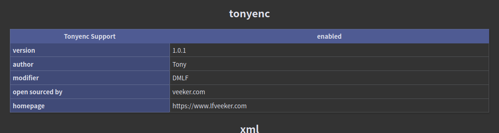

# 热血沸腾的组合技

- 作者：13m0n4de
- 参考：-
- 难度：Baby/Trivial/Easy/Normal/Medium/Hard/Expert/Insane
- 分类：Web
- 镜像：[svuctf-winter-2023/tonyenc](ghcr.io/svuctf/svuctf-winter-2023/tonyenc:latest)
- 端口：80

## 题目描述

「Web+Reverse ？真是被看扁了啊...」\
「我们的友谊、我们的羁绊，怎么会...」\
「为了无数个大家，为了充满无限可能的未来...」\
「见识一下吧，这就是我们热血沸腾的组合技！」

## 题目解析

题目给了两个功能，`/?action=phpinfo` 可以显示 PHPINFO 页面，`/?action=download&file=` 可以下载任意文件。

当尝试下载 `index.php` 源码时，会发现全是乱码：

明明是乱码，却能执行？

于是你去搜索 `PHP 源码 加密`，~~或者关闭容器~~。

应该能搜到不少介绍，它们会告诉你 PHP 源码加密/保护 有几种类型：

1. 源代码混淆
2. OPCODE 混淆
3. 修改解释引擎

其中在部署上又分为无扩展和有扩展方案，先别着急看那么多文章，我们的首要任务是判断这题的文件属于哪个方案，高效的捷径。不然大脑占用过高，回到题目的时候宕机了。

其中无拓展方案只有源代码混淆，在用这种方案混淆的源文件中，你应该能看到 `<?php` 标签，许多可见的关键字和函数名，当然也有很多不可见字符，它们就像夹在 PHP 代码中一样。诸如此类特征。

因为无拓展方案必须要求文件内容本身是合规的 PHP 语法，再在此基础上混淆变量函数等名称（使用各种函数进行编码加密）。

这里的情况并不符合，`index.php` 完全是乱糟糟的不可见字符。

所以，它至少是有拓展的。至于那到底是三种方案里的哪种，可以先试着找到它用的拓展找出来。

访问 PHPINFO 页面，翻到 `Configuration` 栏目。

这里通常也包含了各个 PHP 模块的配置信息，可能是 PHP 核心模块，也可能是通过扩展（ extension ）添加的第三方模块。

如果你不熟悉 PHP ，不清楚哪些是核心模块哪些是外部扩展模块，可以用相同版本的 PHP 搭建 PHPINFO 页面，对比一下。再不济，一个个在网上搜索吧.....

最后你会定位到一个模块：tonyenc

然后你就应该能搜到很多指资料了，包括但不限于两个仓库：

- https://github.com/lihancong/tonyenc
- https://gitee.com/lfveeker/tonyenc

后者是前者的修改版，支持了 PHP 8，PHPINFO 中可以得知我们的题目是 PHP 8，所以用的是后面这个仓库。

根据特点描述，可以判断出它不是 *OPCODE混淆* 也不是 *修改解释引擎* 类型的，还原起来会相对简单不少。

文档中说明，它的使用方式是：先编译 .so 扩展文件，将 .so 放入 PHP 扩展文件夹，并在修改配置文件中添加扩展文件名，然后使用自带工具加密 PHP 文件。

那么我们可以先读取配置文件 `php.ini` ，配置文件路径在 PHPINFO 中有，当然试几个默认路径也可以。

